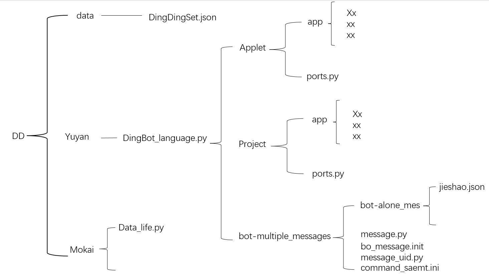
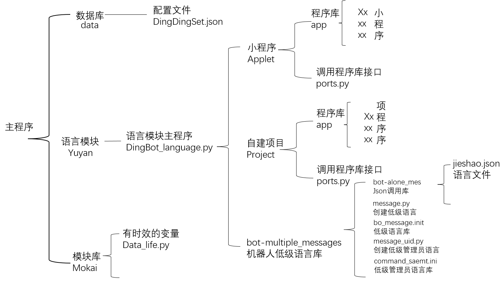
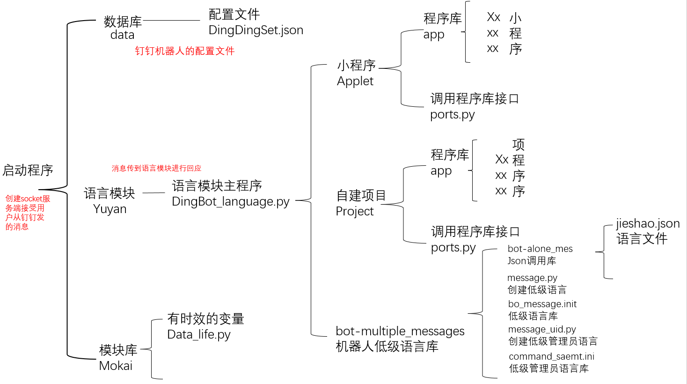

# 钉钉企业机器人2022版
主要模块： multiprocessing,requests,json,time,hmac,hashlib,base64,socket,os     
私模块：[时效变量](./Mokai/Data_life.py)

## 使用
前景：已经从钉钉官网配置好了**钉钉企业机器人**并加进了钉钉群<br/>
填写钉钉企业机器人的参数 [配置文件](./data/DingDingSet.json)<br/>

启动：<br/>
```python3 DingDingBot.py```

>注意此程序无法被钉钉Ping到,所以无法进行验证,但是验证过后依旧可以接受钉钉的消息,不影响  
>验证文件按照 [钉钉机器人配置](https://blog.csdn.net/weixin_44659366/article/details/115048223) 程序配置一个就可以了    

## 简介：
使用 socket 搭建服务端 接受来自钉钉的消息 

## 主程序介绍
1. DingDing.py<br/>
主程序调动其他程序
***
**钉钉机器人初始化**  
DingDing_chushihua<br/>
|    模块     | 说明                                                         |
| :---------: | ------------------------------------------------------------ |
| `钉钉机器人初始化` | 获取钉钉客户端发出的API消息，并分析接口转换成可用的变量    |
|       变量        |         说明        | 
|   dd_post_userid  |     用户在群里的身份id(非私发ID) |
|   dd_post_mes     |     用户发送的消息 |
|   dd_post_moshi   |    用户发送的模式 1:单独发送[单聊] 2:群里发送[群聊] 
|   dd_post_userIds |    用户的私人ID  |
| dd_post_isAdmin | 是否为群的管理员 true/false | 
| dd_post_senderNick | 发送者的名称 |
|dd_post_sign、dd_post_timestamp|用于群聊消息签名验证|

***   
**钉钉机器人群聊模块**    
DingDing_group<br/>
|    模块     | 说明                                                         |
| :---------: | ------------------------------------------------------------ |
| `DingDing_group` | 暂无|
***
**钉钉机器人配置模块**    
DingDingSet()<br/>
|    模块     | 说明                                                         |
| :---------: | ------------------------------------------------------------ |
| `DingDingSet` | 从 DingDingSet.json 读取 Webhook,AppSecret,AppKey 的配置信息

***
**钉钉机器人单聊(私发)模块**   
DingDing_single<br/>

|    模块     | 说明                                                         |
| :---------: | ------------------------------------------------------------ |
| `钉钉机器人单聊(私发)模块` | 钉钉私法与群发的验证方式不一样，并且需要获取时效两小时的身份码，又因为不能频繁的调取身份码，所以在程序启动时先获取一个身份码记录在本地变量里，再设置一个时效两小时，时间一到自动销毁，后续调取本地变量时发现数据消失则重新获取。     |

**单聊模块具体函数介绍**   

|       函数        |         可传参数        |  参数作用  | 说明                                      |
| :---------------: | :----------------------------------------------------------: | :----: | ------------------------------------------------------------ |
|    `DingDing_single`     |    dd_post_userIds, dd_post_mes        | 用户ID，消息体 | 与群聊消息一样调用消息体，但是获取消息后转义成自身可识别的json |
|    `DingDing_single_accessToken_chushihua`    | 由DingDing_single_accessToken_time启动 | 被动 | 获取钉钉单聊(私法)所需要的身份码 |
|    `DingDing_single_accessToken_time`    | 无 | 无 | 从DingDing_single_accessToken_chushihua获取身份码，并设置时效，在本地创建后面用来对比的身份码变量 |
|    `DingDing_single_accessToken_yanzheng`    | 无 | 无 | 其他函数调用此函数获取身份码，并与初始身份码对比，有区别则重新启动DingDing_single_accessToken_time |
|    `DingDing_single_accessToken_yanzheng_backup`    | 由DingDing_single_accessToken_yanzheng启动 | 被动 | DingDing_single_accessToken_yanzheng发现身份码过期，重新获取身份码后，重新开个管道运行之前卡顿的命令 |
|    `DingDing_single_xiaoxiti_zhuanyi`    | dd_post_userIds, send_mes | 用户ID(私发),消息体 | 从群聊的消息模块获取信息体,并转换成自成可用的消息体  暂时只支持Text与Markdown的消息转换|

**注意传参时接口有多少参数就要传多少,无参数也要用None表达,否则报错**

### 传参介绍
DingDing_group传出的参数有
```dd_post_userid, dd_post_sign, dd_post_timestamp, dd_post_mes, dd_post_userIds, dd_post_senderNick, dd_post_isAdmin```

DingDing_single传出的参数有
```dd_post_userid, dd_post_mes, dd_post_userIds, dd_post_senderNick, dd_post_isAdmin```

### 模块介绍
- [语言模块](./Yuyan/README.md)

### 文件结构
   
   
  
